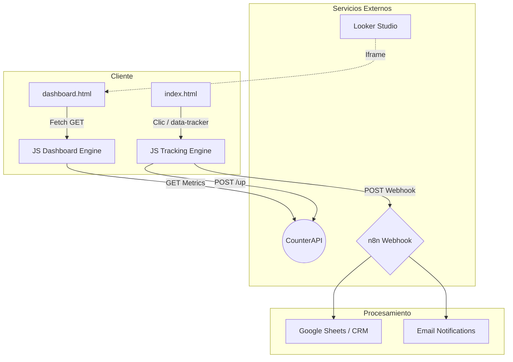
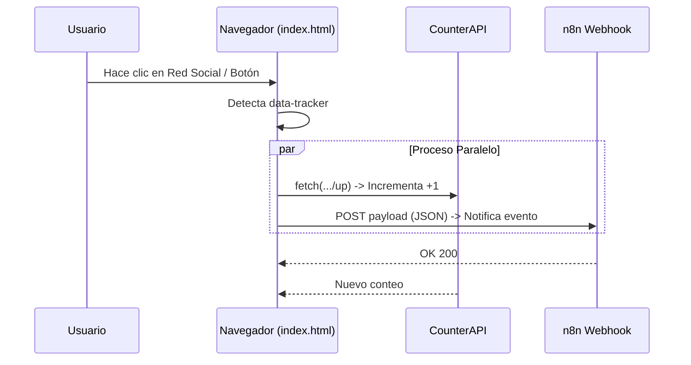

# 📘 Guía de Documentación y Comprensión - Proyecto AXELONGO

Esta guía detalla la arquitectura, lógica y estructura del ecosistema web de AXELONGO, diseñado para ofrecer una experiencia de usuario dinámica y un seguimiento de métricas en tiempo real.

---

## 🚀 1. Visión General (Overview)

### ¿Qué hace el sistema?
Es una plataforma web institucional de marca personal/agencia que integra:
- **Landing Page de Alto Impacto:** Presentación de servicios (Marketing, Publicidad, Diseño Web).
- **Sistema de Seguimiento (Tracking):** Rastreo automático de interacciones sin necesidad de una base de datos propia.
- **Panel de Análisis Privado (Dashboard):** Visualización de métricas de clics y reportes avanzados de Looker Studio.

### ¿Para quién es?
Para el equipo de AXELONGO, permitiendo monitorear qué servicios y redes sociales generan más interés.

### Flujo Principal
1. El usuario navega por `index.html`.
2. Cada clic en botones críticos o redes sociales dispara un evento invisible.
3. El evento se guarda en un contador externo (**CounterAPI**) y se envía un webhook a **n8n**.
4. El administrador accede a `dashboard.html` para ver los resultados en tiempo real.

---

## 🧩 2. Arquitectura

El proyecto sigue un modelo de **Frontend Estático con Microservicios Externos**:

- **Frontend:** HTML5 / Tailwind CSS / JavaScript Vanilla.
- **Métricas Rápidas:** [CounterAPI](https://counterapi.dev/) (Almacenamiento volátil de conteos).
- **Procesamiento de Datos:** [n8n](https://n8n.io/) (Webhook para recibir leads e interacciones).
- **Visualización Avanzada:** [Google Looker Studio](https://lookerstudio.google.com/) (Reportes de tráfico de GA4).

### Diagrama de Arquitectura


---

## 🔄 3. Flujo de la Lógica (Métricas e Interacciones)

### Diagrama de Secuencia de Interacción


Esta es la parte vital para entender cómo se conectan los archivos:

### A. Captura de la Interacción (`index.html`)
El archivo principal contiene un script al final que escucha **todos** los clics en el documento.
- Si el elemento tiene el atributo `data-tracker` (ej: `data-tracker="social_fb"`), el script sabe que debe contar ese clic.
- **Doble Acción:**
    1. Envía un `fetch` a `counterapi.dev` para sumar +1 al contador específico.
    2. Envía un JSON completo al Webhook de **n8n** con detalles como: qué botón fue, en qué página está y la hora exacta.

### B. Visualización en el Panel (`dashboard.html`)
- Al cargar, el dashboard recorre una lista de claves (`social_fb`, `cat_marketing`, etc.).
- Realiza peticiones `GET` a la API para obtener el valor actual.
- Actualiza los números en la pantalla automáticamente cada 60 segundos.

---

## 📁 4. Estructura del Proyecto

- `index.html`: La puerta de entrada. Contiene toda la estructura visual y el motor de tracking.
- `dashboard.html`: Interfaz administrativa protegida (visual).
- `GUIA_ESTRUCTURA.txt`: Documento técnico de referencia sobre la organización de archivos.
- `sistema_web/`:
    - `/assets`: Contiene CSS, JS minificado y archivos exportados del constructor (WordPress/Spectra).
    - `/uploads`: Imágenes y recursos multimedia.
- `paginas/`: Directorios con contenido específico de secciones como "Nosotros" o "Blog".

---

## ⚙️ 5. Módulos y Componentes Críticos

### 1. El Tracker Global (`index.html`)
Ubicado al final de `index.html`, es el encargado de la "magia" del seguimiento.
```javascript
document.addEventListener('click', function(e) {
    const target = e.target.closest('[data-tracker]');
    if (target) {
        const trackerKey = target.getAttribute('data-tracker');
        // Incrementa el contador en la nube
        fetch(`https://api.counterapi.dev/v1/axelongosite/${trackerKey}/up`);
    }
});
```

### 2. El Motor del Dashboard (`dashboard.html`)
Utiliza funciones asíncronas para traer datos de múltiples fuentes sin bloquear la página.
- **Función `updateMetrics()`:** Itera sobre el array de métricas y actualiza el DOM.
- **Iframe de Looker Studio:** Integra el reporte visual de Google Analytics 4.

### 3. Secuencia de Auto-Scroll (`index.html`)
Para mejorar el SEO y la retención, el sitio tiene una lógica de "clics fantasma" que activan las pestañas de servicios automáticamente a los 4, 6.5 y 9 segundos de la carga.

---

## 🔑 6. Funciones Críticas

### `fetch(.../up)`
**Ubicación:** `index.html`
**Propósito:** Es la señal de "incremento". Sin esto, el contador no se mueve. Es vital que el nombre en `data-tracker` coincida exactamente con el que se quiere ver en el dashboard.

### `updateMetrics()`
**Ubicación:** `dashboard.html`
**Propósito:** Centraliza la actualización de la interfaz. Maneja errores de red (si la API falla, muestra un mensaje de error en rojo en lugar de romperse).

---

## 📁 7. Guía Detallada de Archivos y Carpetas

### 📂 Directorio Raíz (`/`)
- **[index.html](file:///Users/axelsoberanes/Desktop/simply-static-1-1776385799/index.html)**: 
    - **Lógica:** Es el motor principal del sitio. Contiene el HTML de la landing page y el **Tracker de Clics Global**. 
    - **Funcionalidad:** Escucha eventos de usuario, gestiona el menú móvil y ejecuta la secuencia automática de clics en la sección de servicios para guiar al usuario.
- **[dashboard.html](file:///Users/axelsoberanes/Desktop/simply-static-1-1776385799/dashboard.html)**: 
    - **Lógica:** Interfaz de visualización de datos. No guarda información, solo la consulta.
    - **Funcionalidad:** Realiza peticiones asíncronas (`fetch`) a CounterAPI para mostrar conteos y embebe un reporte externo de Google Looker Studio para analítica avanzada.
- **[DOCUMENTACION.md](file:///Users/axelsoberanes/Desktop/simply-static-1-1776385799/DOCUMENTACION.md)**: 
    - **Lógica:** Manual técnico del sistema (este archivo).
- **[GUIA_ESTRUCTURA.txt](file:///Users/axelsoberanes/Desktop/simply-static-1-1776385799/GUIA_ESTRUCTURA.txt)**: 
    - **Lógica:** Un mapa rápido de directorios para referencia inmediata del desarrollador.

---

### 📂 Directorio `sistema_web/`
Esta carpeta contiene el núcleo técnico heredado del generador estático (WordPress).
- **index.html**: Una página secundaria (sección Filosofía) que mantiene la consistencia visual del sitio.
- **📂 assets/**:
    - **📂 css/**: Contiene archivos como `dashboard-app.css`. Estos definen la estética de los componentes del constructor Spectra y el tema Astra.
    - **📂 plugins/**: Almacena la lógica de terceros (AOS para animaciones al hacer scroll, Swiper para sliders, Spectra para bloques dinámicos).
    - **📂 themes/**: Específicamente el tema **Astra**, encargado de la estructura base (header, footer, tipografía global).
    - **📂 uploads/**: El repositorio de medios. Aquí se encuentran todas las imágenes, el favicon y los logos oficiales de AXELONGO.

---

### 📂 Directorio `paginas/`
Contiene las subsecciones del sitio exportadas como archivos HTML independientes.
- **Lógica:** Cada carpeta dentro (ej: `nosotros/`, `blog/`) contiene un `index.html` propio. Esto permite que las URLs del sitio sean limpias (ej: `axelongo.com/nosotros`).

---

## 🚨 8. Casos Especiales / Errores

- **¿Qué pasa si falla CounterAPI?** El sitio seguirá funcionando perfecto. El usuario no notará nada, simplemente no se registrará la métrica en ese momento (error manejado con `.catch()`).
- **¿Qué pasa si el Webhook de n8n está offline?** Los datos de formularios no llegarán al CRM/Email, pero el frontend mostrará una alerta de "Error de conexión" para que el usuario sepa que algo falló.
- **Cache:** El dashboard usa un parámetro `?t=${Date.now()}` en las peticiones para evitar que el navegador guarde datos viejos y siempre muestre el número real.

---

## 🧪 9. Cómo probarlo

1. **Simular Clic:** Abre `index.html` en tu navegador, haz clic en el icono de WhatsApp.
2. **Verificar Consola:** Presiona F12 (Inspeccionar) y verás los logs de `fetch`.
3. **Ver en el Dashboard:** Abre `dashboard.html` y deberías ver el número de WhatsApp incrementado en 1 (o el valor actual actualizado).
4. **Formulario:** Completa el formulario de contacto y verifica que aparezca la alerta de "¡Gracias por contactarnos!".

---
*Documentación generada para el equipo de desarrollo AXELONGO v1.0*
