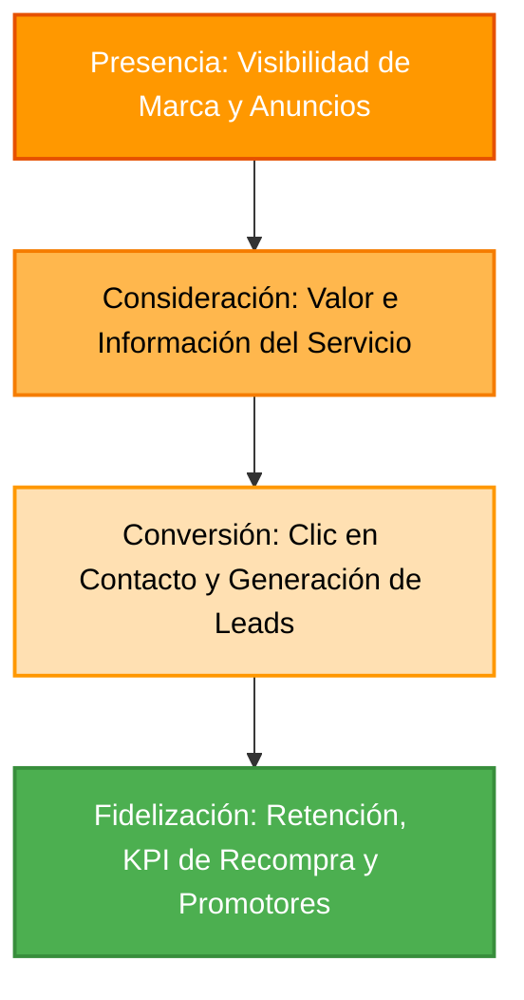
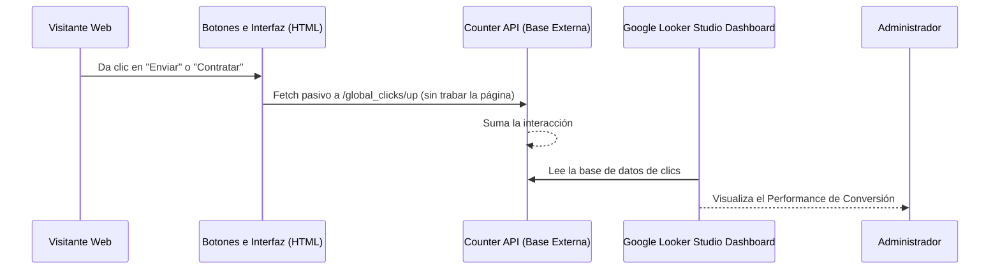
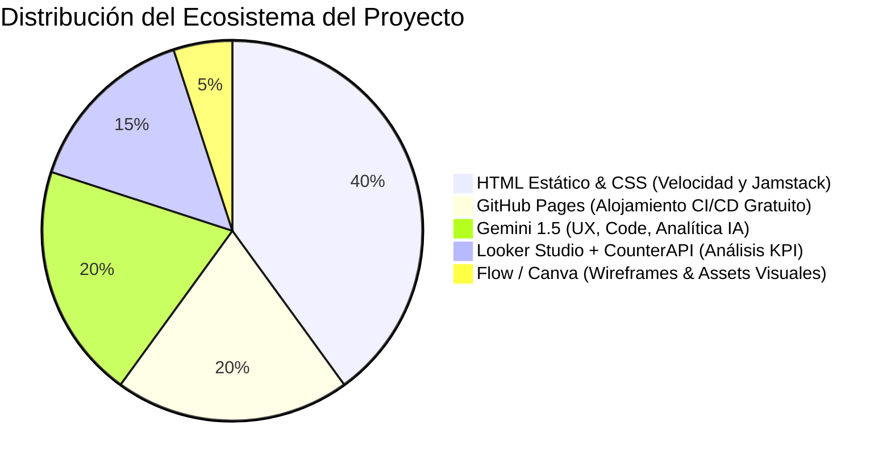
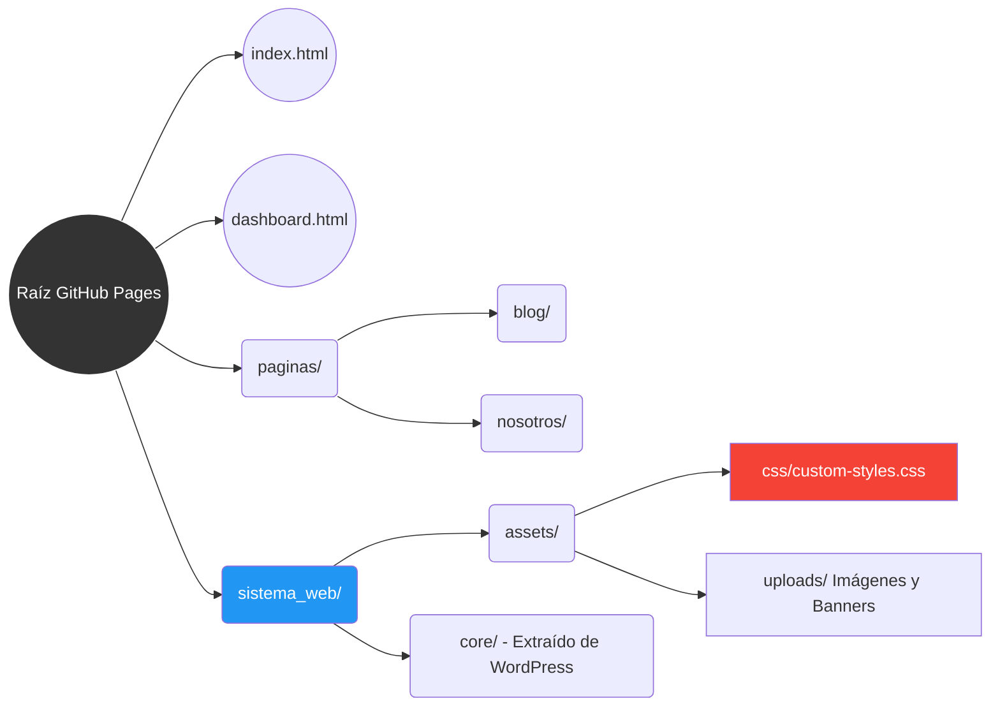

# Tarjetas de Presentación Digitales - Documentación de Desarrollo

Este documento sirve como la guía técnica oficial y visual para el proyecto **Tarjetas de Presentación Digitales**, alojado de forma estática en GitHub Pages. A continuación, se detallan los ecosistemas comerciales, la ruta de datos y la arquitectura construida mediante diagramas técnicos modernos.

---

## 1. El Embudo de Conversión (Funnel de Marketing)

El núcleo del negocio está estructurado para capturar prospectos y filtrarlos estratégicamente. Nuestra meta principal es medir el `% de retención` en cada etapa del túnel.

*   **Presencia**: Captura inicial del usuario hacia `index.html`.
*   **Consideración**: Usuario lee métricas y consume contenido.
*   **Conversión**: Acciona nuestros "Botones tipo Píldora Naranjas".
*   **Fidelización**: Seguimiento y aumento del Lifetime Value (Tiempo de Vida del Cliente).

---

## 2. Diagrama de Rastreo Analítico (Looker Studio + CounterAPI)

Para no saturar el código con bases de datos ni ralentizar la web (lo cual rompería la retención), desarrollamos un modelo "Event-Driven" de clics pasivos:

---

## 3. Topología Tecnológica (Stack de Herramientas)

Todo el proceso de desarrollo está orquestado por un ecosistema engranado, donde cada pieza cumple una función singular para reducir costos operativos:

---

## 4. Arquitectura de Directorios (Mapeo de Carpetas)

Aislar correctamente los "Assets" (CSS, JS, Imágenes) de la estructura del "Frontend" (Páginas) previene cuellos de botella al momento de actualizar o diseñar componentes en el futuro.

### Funciones Principales Destacadas
*   `custom-styles.css`: Dicta todo el sistema de botones, *paddings* responsivos de las cajas amarillas (Grid containers) y anula el efecto de código espagueti de temas base.
*   `dashboard.html`: Actúa como una carcasa en blanco cuya única misión es envolver nuestro `iframe` de Google Data Studio de la forma más limpia posible para el gerente del negocio.
