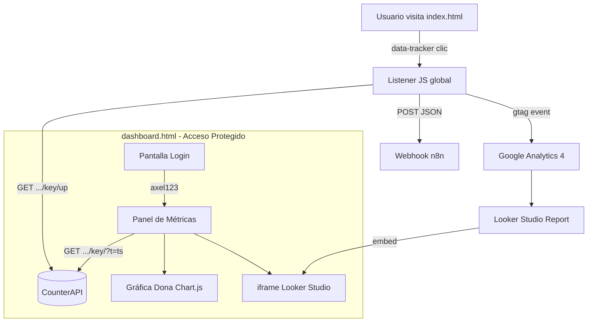

# Manual de Ingeniería y Arquitectura: Sistema AXELONGO v3.0
## Documentación Técnica Exhaustiva del Ecosistema Jamstack

> **Versión:** 3.0.0 — Actualizada el 17 de Abril, 2026  
> **Autoría:** Desarrollado y documentado por Antigravity AI Engine  
> **Repositorio:** `AXELONGO/AXELONGO.github.io` (rama `main`)

---

## 1. Introducción y Filosofía del Desarrollo

El sistema está construido bajo la filosofía **Jamstack** (JavaScript, API y Markup). A diferencia de los sitios tradicionales monolíticos, este ecosistema separa completamente la capa de presentación de la capa de datos.

- **Performance Extremo**: Carga instantánea al servirse desde la CDN de GitHub Pages.
- **Seguridad Total**: Al ser archivos estáticos `.html`, no hay vectores de ataque de inyección SQL.
- **Escalabilidad Infinita**: GitHub CDN absorbe picos de tráfico sin latencia adicional.

---

## 2. Mapa Estructural de la Aplicación

```
AXELONGO.github.io/
├── index.html                   ← Landing principal + motor de rastreo
├── dashboard.html               ← Panel privado de analítica (acceso con contraseña)
├── DOCUMENTACION_SISTEMA_V2.md ← Este documento
├── paginas/
│   ├── nosotros/index.html
│   └── blog/index.html
└── sistema_web/assets/
```

---

## 3. Flujo Completo de Métricas: index.html → CounterAPI → dashboard.html

Esta es la conexión central del sistema. Los dos archivos se comunican de forma **asíncrona** a través de una API pública externa.

### Paso 1: El Usuario Visita index.html
El navegador carga el HTML estático. Al final del `<body>` hay un bloque de JavaScript que escucha **eventos de clic** globales usando delegación de eventos. Cada botón rastreable tiene el atributo `data-tracker`:

```html
<a href="https://wa.me/..." data-tracker="social_wa">WhatsApp</a>
```

```js
document.addEventListener('click', function(e) {
  const tracker = e.target.closest('[data-tracker]');
  if (!tracker) return;
  const key = tracker.dataset.tracker;
  fetch(`https://api.counterapi.dev/v1/axelongosite/${key}/up`, {
    keepalive: true, mode: 'no-cors'
  });
});
```

### Paso 2: CounterAPI Recibe el Incremento
URL de escritura (sin barra final):
```
https://api.counterapi.dev/v1/axelongosite/{key}/up   ✅ Correcto
https://api.counterapi.dev/v1/axelongosite/{key}/up/  ❌ Error 301
```

### Paso 3: dashboard.html Lee los Contadores
URL de lectura (con barra + cache-buster):
```
https://api.counterapi.dev/v1/axelongosite/{key}/?t=1713345600000  ✅ Correcto
https://api.counterapi.dev/v1/axelongosite/{key}?t=1713345600000   ❌ Error 301
```
El `?t=Date.now()` garantiza que el navegador no devuelva una respuesta cacheada.

---

## 4. Mapa de Contadores (`data-tracker` ↔ Dashboard)

| `data-tracker` en index.html | ID en dashboard.html   | Descripción                    |
|------------------------------|------------------------|--------------------------------|
| `social_fb`                  | `count-social_fb`      | Clics en ícono Facebook        |
| `social_wa`                  | `count-social_wa`      | Clics en ícono WhatsApp        |
| `social_ig`                  | `count-social_ig`      | Clics en ícono Instagram       |
| `social_tk`                  | `count-social_tk`      | Clics en ícono TikTok          |
| `social_yt`                  | `count-social_yt`      | Clics en ícono YouTube         |
| `cat_marketing`              | `count-cat_marketing`  | Clics en pestaña Marketing     |
| `cat_publicidad`             | `count-cat_publicidad` | Clics en pestaña Publicidad    |
| `cat_web`                    | `count-cat_web`        | Clics en pestaña Diseño Web    |

> **Nota de Migración (v3.0):** X (Twitter) → WhatsApp (`social_wa`) y LinkedIn → TikTok (`social_tk`). Los nuevos contadores requirieron una primera petición manual `/up` para inicializarse; sin ella, la API devuelve `HTTP 400`.

---

## 5. Arquitectura de dashboard.html

### 5.1. Sistema de Autenticación por Contraseña

El dashboard implementa bloqueo basado en `sessionStorage`. El contenido está **oculto por defecto** (`display: none`) y solo se revela tras autenticación exitosa.

**Flujo de autenticación:**
```
Carga de página → checkAuth()
  ├── sessionStorage === 'granted' → Mostrar contenido + updateMetrics()
  └── No autenticado → Pantalla de login visible
        └── verifyPassword()
              ├── Contraseña correcta → sessionStorage = 'granted' → Fade 300ms → updateMetrics()
              └── Contraseña incorrecta → Error visual 2s
```

**Contraseña actual:** `axel123`

**IMPORTANTE — Orden del JS:** Las funciones deben declararse en este orden exacto para evitar que `checkAuth()` invoque funciones que aún no existen:

```js
const metrics = [...];            // 1. Definir datos
let serviciosChart = null;        // 2. Estado de gráfica
async function updateMetrics() {} // 3. Motor de datos
function actualizarGrafica() {}   // 4. Motor visual
function checkAuth() {}           // 5. Auth (usa updateMetrics)
function verifyPassword() {}      // 6. Auth
checkAuth();                      // 7. Ejecución — siempre al final
setInterval(...);                 // 8. Refresco periódico
```

**Vida de la sesión:** El `sessionStorage` se borra al cerrar la pestaña. No hay cookies persistentes.

### 5.2. Motor de Carga de Métricas (`updateMetrics`)

Las peticiones se hacen de forma **secuencial** con 100ms de delay entre cada una:
- Respeta el rate limit de CounterAPI (30 req/min)
- Evita activar heurísticas de AdBlockers que detectan ráfagas de peticiones como trackers agresivos

### 5.3. Gráfica de Servicios (Chart.js)

Tras cargar todas las métricas, `updateMetrics()` alimenta la gráfica de dona con los datos de los drei servicios. Usa el patrón **singleton** para evitar crear múltiples instancias en cada refresco:

```js
if (serviciosChart) {
  serviciosChart.data.datasets[0].data = [mkt, pub, web]; // Actualizar datos
  serviciosChart.update();
} else {
  serviciosChart = new Chart(ctx, { ... }); // Crear solo la primera vez
}
```

---

## 6. Stack Tecnológico

| Tecnología | Versión/ID | Uso |
|-----------|-----------|-----|
| CounterAPI | v1 | Contadores de clics cuantitativos |
| Chart.js | 4.4.0 (CDN) | Gráfica de dona de servicios |
| Looker Studio | Embed API | Reporte cualitativo de comportamiento |
| Google Analytics 4 | G-2JYJJ3DXFC | Telemetría de sesiones |
| n8n Webhook | hf.space | Captura de leads del formulario |
| Tailwind CSS | CDN | Estilos del dashboard |
| FontAwesome | 6.5.1 | Iconografía |

---

## 7. Diagrama de Flujo del Sistema



---

## 8. Buenas Prácticas Aplicadas (v3.0)

| Área | Práctica |
|------|----------|
| **SEO** | `noindex, nofollow` para excluir el dashboard de buscadores |
| **Accesibilidad** | `aria-label`, `role="alert"`, `aria-hidden="true"` en íconos decorativos |
| **Formularios** | `<label>` vinculado con `for`, `autocomplete="current-password"` |
| **Performance** | Peticiones secuenciales con delay de 100ms |
| **JS Correctness** | Variables y funciones definidas antes de ser invocadas |
| **Chart.js** | Patrón singleton para evitar instancias duplicadas |
| **UX** | Feedback visual inmediato con limpieza automática (2s) |
| **Mantenibilidad** | Array `metrics` centralizado como fuente única de verdad |

---

## 9. Guía Rápida: Agregar un Nuevo Contador

1. En `index.html`: añadir `data-tracker="nuevo_nombre"` al elemento HTML
2. En `dashboard.html`: añadir `'nuevo_nombre'` al array `metrics`
3. En `dashboard.html`: crear `<span id="count-nuevo_nombre">0</span>` en el HTML
4. **Inicializar** el contador (solo la primera vez):
   ```bash
   curl https://api.counterapi.dev/v1/axelongosite/nuevo_nombre/up
   ```

---

## 10. Historial de Versiones

| Versión | Fecha | Cambios principales |
|---------|-------|-------------------|
| 1.0 | Abr 2026 | Migración WordPress → Jamstack estático |
| 2.0 | Abr 2026 | Dashboard v1: CounterAPI + Looker Studio |
| 2.1 | Abr 2026 | Fix URLs CounterAPI (trailing slash), keepalive en rastreadores |
| 2.2 | Abr 2026 | Migración redes sociales: X→WhatsApp, LinkedIn→TikTok |
| **3.0** | **Abr 2026** | **Autenticación con contraseña, gráfica Chart.js, noindex, aria-labels, singleton pattern** |
