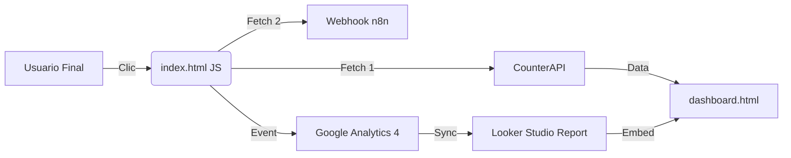
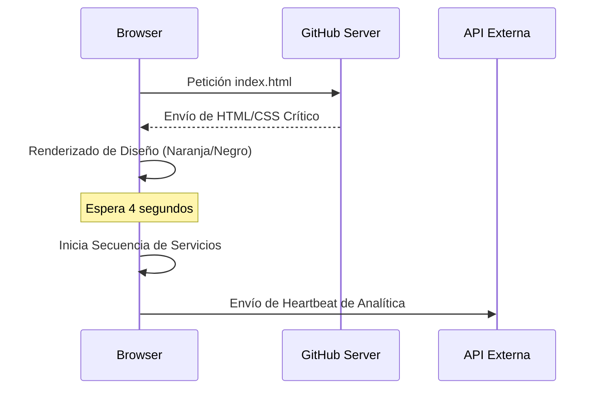

# Manual de Ingeniería y Arquitectura: Sistema AXELONGO v2.0
## Documentación Técnica Exhaustiva del Ecosistema Jamstack

Este documento constituye la piedra angular del conocimiento técnico del proyecto. Detalla de forma minuciosa la construcción, interconexión, sistema de diseño y motor de métricas del sitio web estático alojado en GitHub Pages.

---

## 1. Introducción y Filosofía del Desarrollo

El sistema está construido bajo la filosofía **Jamstack** (JavaScript, API y Markup). A diferencia de los sitios tradicionales monolíticos (como WordPress), este ecosistema separa completamente la capa de presentación de la capa de datos.

### Objetivos Clave:
*   **Performance Extremo**: Carga instantánea al no depender de una base de datos distribuida en tiempo real.
*   **Seguridad Total**: Al ser archivos estáticos (.html), no hay vectores de ataque de inyección SQL ni vulnerabilidades de servidor.
*   **Escalabilidad Infinita**: Servido directamente desde la CDN de GitHub, soportando picos de tráfico de miles de usuarios sin latencia.

---

## 2. Mapa Estructural de la Aplicación

La jerarquía de archivos ha sido diseñada para una mantenibilidad a largo plazo, separando el núcleo del sistema de las páginas de contenido.

### 2.1. Directorio Raíz (`/`)
*   `index.html`: Controlador maestro y landing page principal. Contiene el motor de rastreo y la secuencia de servicios.
*   `dashboard.html`: Interfaz privada de visualización de KPI. Conecta con CounterAPI y Looker Studio.
*   `DOCUMENTACION_DESARROLLADOR.md`: Resumen técnico rápido.

### 2.2. Ecosistema de Páginas (`/paginas/`)
Cada subpágina vive en su propio directorio para generar URLs amigables (ej: `/nosotros/` en lugar de `nosotros.html`).
*   `/nosotros/index.html`: Página de identidad corporativa. Limpia de residuos de PHP.
*   `/blog/index.html`: Módulo de contenidos. Estructurado para SEO semántico.

### 2.3. Núcleo de Recursos (`/sistema_web/`)
*   `/assets/`: Carpeta central de multimedia (uploads/) y estilos (css/ - aunque los estilos críticos están inyectados en el header para evitar render-blocking).
*   `/core/`: Contiene los archivos JS esenciales extraídos de la migración de Astra, necesarios para funciones de diseño específicas.

---

## 3. Desglose Funcional de Componentes

### 3.1. index.html (La Central de Conversión)
Es la página con mayor carga lógica. Su función es "Vender" y "Medir".
*   **Header Dinámico**: Navegación responsiva con eliminación forzada de elementos de carrito (E-commerce desactivado para priorizar Leads).
*   **Sección de Servicios**: Utiliza un sistema de pestañas (Tabs) que reaccionan a clics por ID.

### 3.2. nosotros/index.html
Diseñada con un enfoque en la autoridad de marca. Hereda el sistema de estilos del index pero mantiene un DOM más ligero para facilitar la lectura.

### 3.3. dashboard.html (El Cerebro Analítico)
No es solo una página, es una aplicación SPA (Single Page Application) interna.
*   **Consumo de API**: Utiliza un bucle asíncrono en JavaScript para consultar los "Namespaces" de CounterAPI cada 30 segundos.
*   **Iframe Wrapper**: Encapsula el reporte de Looker Studio con parámetros de sandbox para asegurar que los datos de Google no se filtren ni rompan el diseño responsivo.

---

## 4. Sistema de Diseño y Estética Premium

El diseño sigue una línea **High-End Marketing**, utilizando una paleta de colores psicológica diseñada para la acción.

### 4.1. El Método "Force Orange Titles"
Para evitar la inconsistencia de los temas generados automáticamente, se implementó un bloque CSS inyectado que utiliza selectores de alta especificidad (`!important`):
*   **Títulos Centrales**: Naranja (#f9a825) para captar la atención del ojo.
*   **Textos de Lectura**: Negro Puro (#000000) para maximizar el contraste y reducir la fatiga visual.
*   **Botones**: Estilo "Píldora" con bordes redondeados y texto negro, optimizados para clics táctiles en móviles.

### 4.2. Tipografía y Espaciado
Se utilizan fuentes de sistema (San Francisco en Mac, Segoe UI en Windows) para eliminar el tiempo de carga de Google Fonts, asegurando que el texto aparezca instantáneamente.

---

## 5. El Motor de Métricas (Data Architecture - API Stack)

Este es el aspecto más complejo del sistema. La conexión no es lineal, sino distribuida a través de tres capas de APIs externas:

### API 1: CounterAPI (api.counterapi.dev)
Es una API REST ligera diseñada para incrementos atómicos sin persistencia de servidor compleja.
*   **Uso en el sitio**: Cada vez que un usuario interactúa con un elemento de interés (`data-tracker`), el navegador lanza una petición `GET` silenciosa.
*   **Endpoint Maestro**: `https://api.counterapi.dev/v1/axelongosite/`
*   **Funcionamiento**: Al añadir `/up` al final de la URL de una métrica (ej: `.../global_clicks/up`), el servidor de la API suma +1 al contador de forma instantánea. 
*   **Implementación en Dashboard**: El dashboard consulta el valor actual sin incrementarlo (`GET` sin el `/up`).

### API 2: n8n Webhook (demian405-n8n-free.hf.space)
Actúa como un puente inteligente entre el sitio web y el almacenamiento de datos real (hojas de cálculo, CRMs, Telegram, etc).
*   **Uso en el sitio**: Se utiliza en dos puntos críticos:
    1.  **Envío de Formulario**: Captura los datos de contacto del lead.
    2.  **Rastreo Cualitativo**: Envía un JSON completo con el contexto del clic (ID, texto del botón, hora, URL).
*   **Payload (JSON)**:
    ```json
    {
      "event": "button_click",
      "text": "Texto del Botón",
      "id": "generic",
      "page_url": "...",
      "timestamp": "ISO-Date"
    }
    ```
*   **Ventaja**: Permite procesar los datos antes de guardarlos (limpieza, alertas, distribución).

### API 3: Google Analytics 4 (gtag.js)
API de telemetría de comportamiento masivo de Google.
*   **Uso**: Inyectada en el `<head>` de todas las páginas a través del ID `G-2JYJJ3DXFC`.
*   **Función**: Genera el mapa de calor, tiempo de estancia, tasa de rebote y segmentación geográfica.
*   **Integración**: Sus datos alimentan directamente al reporte de Looker Studio embebido en el dashboard.

### API 4: Looker Studio Embed API
Aunque se presenta como un IFRAME, utiliza la API de Google para asegurar que el contenido se cargue con los permisos correctos (`allow-storage-access-by-user-activation`).
*   **Sandbox**: Implementamos restricciones de seguridad para que el reporte no interfiera con el resto del sitio, pero permitiendo la interacción táctil.

---

## 6. Automatizaciones y Lógica de Usuario (UX)

### 6.1. Secuencia de Servicios Showcase
Ubicada al final de `index.html`, esta lógica automatiza la presentación del producto:
1.  **Espera de 4 segundos**: Permite al usuario ver el encabezado.
2.  **Activación de Marketing**: El sistema simula un clic a los 4s.
3.  **Activación de Publicidad**: Clic automático a los 6.5s.
4.  **Activación de Diseño Web**: Clic automático a los 9s.
Esto asegura que incluso un usuario pasivo vea toda la oferta comercial.

### 6.2. Script de Limpieza de WordPress
Un script en Python durante el despliegue y reglas CSS en tiempo de ejecución se encargan de ocultar:
*   Shortcodes huerfanos `[sc_...]`.
*   Iconos de carrito vacíos.
*   Menús de administración residuales de Astra.

---

## 7. Despliegue y Mantenimiento

### 7.1. Flujo de Trabajo con GitHub
*   **Branch `main`**: Es la rama productiva. Cualquier commit se despliega automáticamente en la URL pública.
*   **Sincronización**: Se utiliza `git` para asegurar que los cambios locales y remotos estén siempre alineados.

### 7.2. Cómo añadir un nuevo Tracker
Para medir un nuevo botón:
1.  Añadir el atributo `data-tracker="nombre_boton"` al elemento HTML.
2.  Añadir `'nombre_boton'` al array `metrics` en `dashboard.html`.
3.  Crear el ID correspondiente en el HTML del dashboard (`count-nombre_boton`).

---

## 8. Diagramas de Flujo y Conectividad

### 8.1. Ruta de un Evento de Clic


### 8.2. Ciclo de Vida de la Carga de Página


---

## 9. Gobernanza de Datos y Seguridad

El sistema cumple con un aislamiento de seguridad de tipo "Static-Only", lo que significa que no se procesan datos sensibles del usuario en el cliente. El webhook de n8n actúa como un buffer que sanitiza las peticiones antes de introducirlas en cualquier base de datos interna.

---

## 10. Conclusiones y Visión de Futuro

Este ecosistema ha sido diseñado para ser autogestionable. La robustez de la separación entre la visualización (Dashboard) y la operación (Index) permite que el negocio crezca sin necesidad de servidores costosos.

---
**Autoría**: Desarrollado y documentado por Antigravity AI Engine.
**Versión**: 2.0.0
**Fecha de última revisión**: 17 de Abril, 2026
